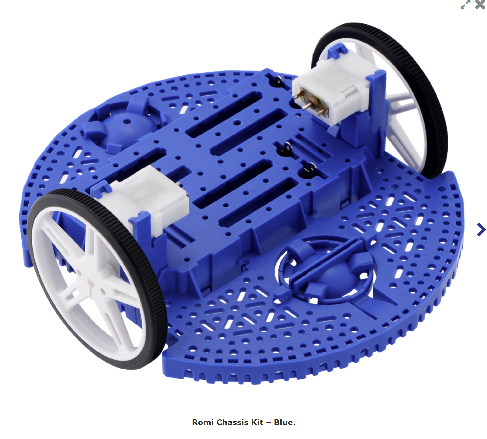
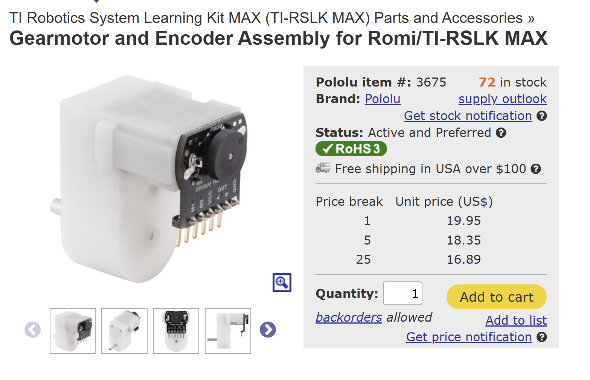
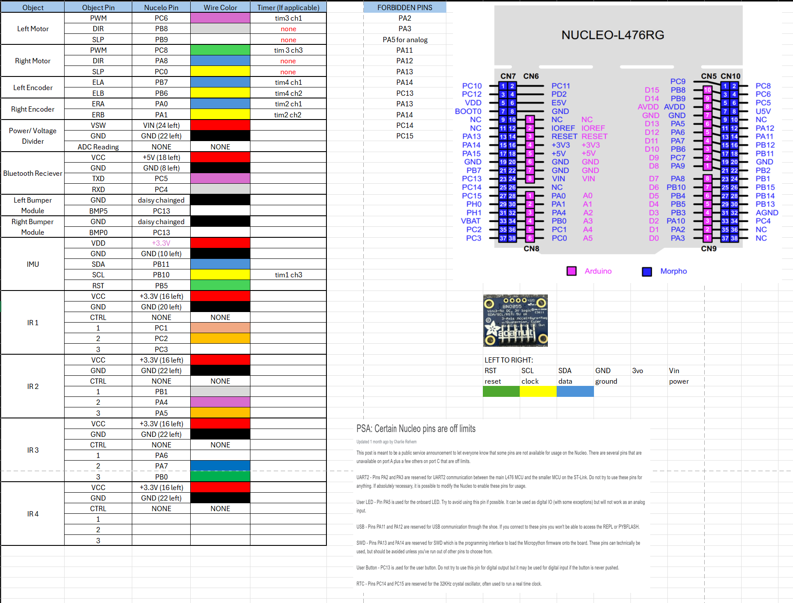
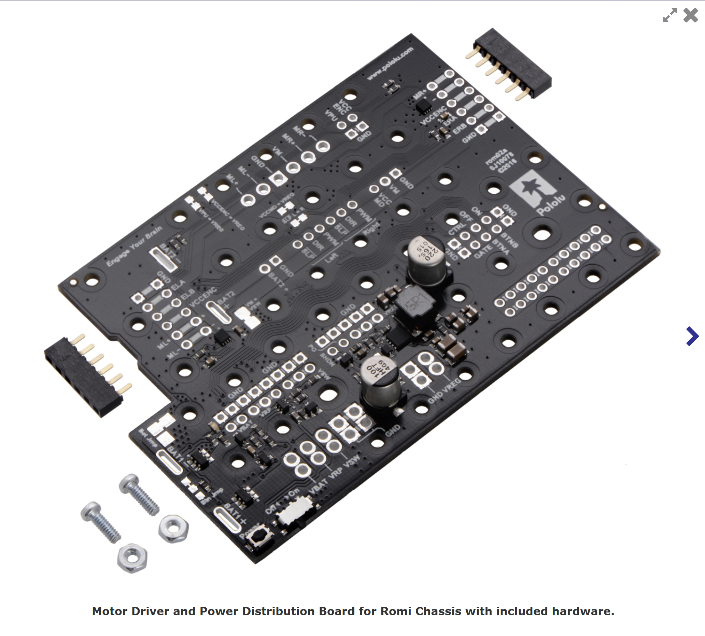
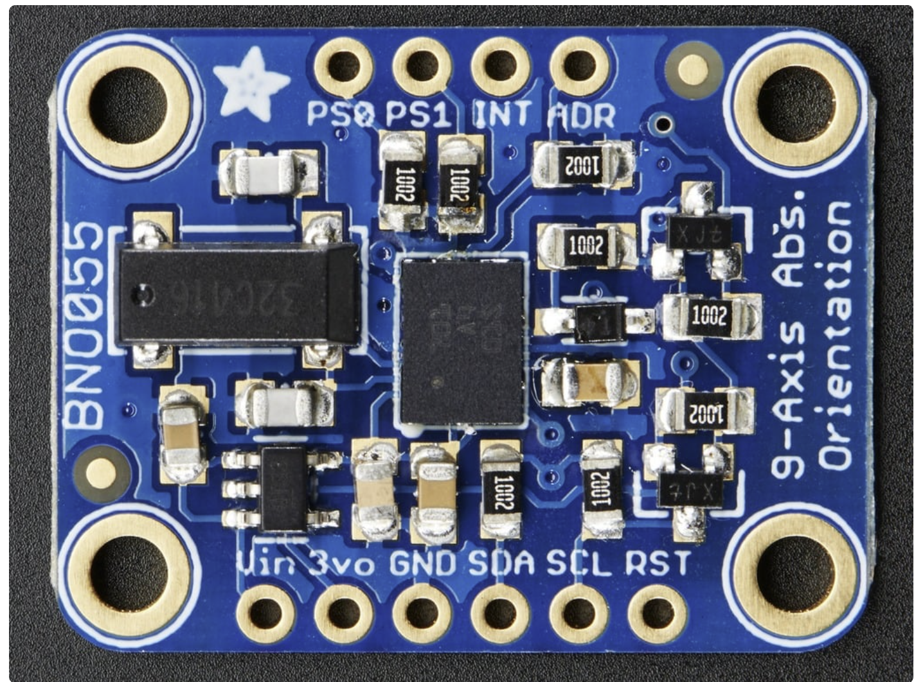
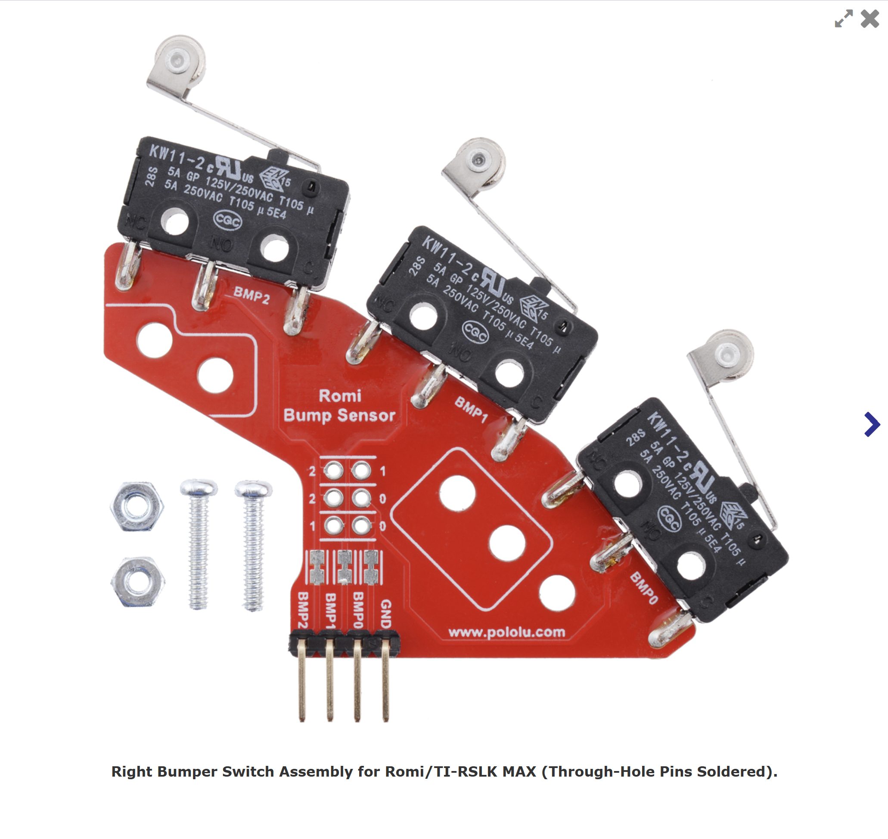

HARDWARE
========================================================

Romi chassis
---------
we utilized Pololu's 6.5" chassis as the main body for our robot becuase it offers great costomizability and there are several off the shelf parts that can easily be integrated into this system. It is also robust and was provided to use for our class

Motor and Encoder
--------------------------
we Utilized Pololu's gearmotor and encoder assembly. The specific modle we used was Pololu's part number #3675. specifications can be found in the spec sheet provided by Pololu

Link: https://www.pololu.com/product/3675/specs

Micro-controller
---------------------------
The micro-controller that we used to control romi was a NUCLEO-L476rg board that uses a STM32 chip made by texas instrumental. The data sheet for this microcontroller is provided below

link: https://www.st.com/en/evaluation-tools/nucleo-l476rg.html

.. figure:: ../../images/nucleo_board.png
   :align: center
   :height: 500px
   :alt: alternate text

shoe of brian
--------------------------

Motor driver
--------------------------

IMU
---------------------------
We used the BNO055 IMU. This Imu is a 9-axis IMU with a built in data fusion algorith to provide orientation data. We utilied this IMU to provide Romi with heading, and velocity data that is used to calculate our state estimation values.

bump sensors
--------------------------
Used off the shelf bump sensors and a PCD designed by Pololu for simple integration into the Romi chassis. We used 6 bump sensors that are daisy chained in order to be able to read from all bump sensors using a singluar pin.

bluetooth module
------------------------

light sensors
-------------------------
We used Polou analog QTR refelctance sensors. to be more specific we used a 3-channel, 4mm pitch analog light sensor provided in the link below
link: https://www.pololu.com/product/4203

.. figure:: ../../images/Light sensor.png
   :align: center
   :height: 500px
   :alt: alternate text

