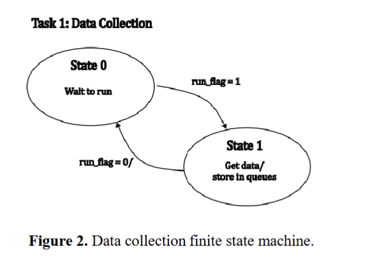
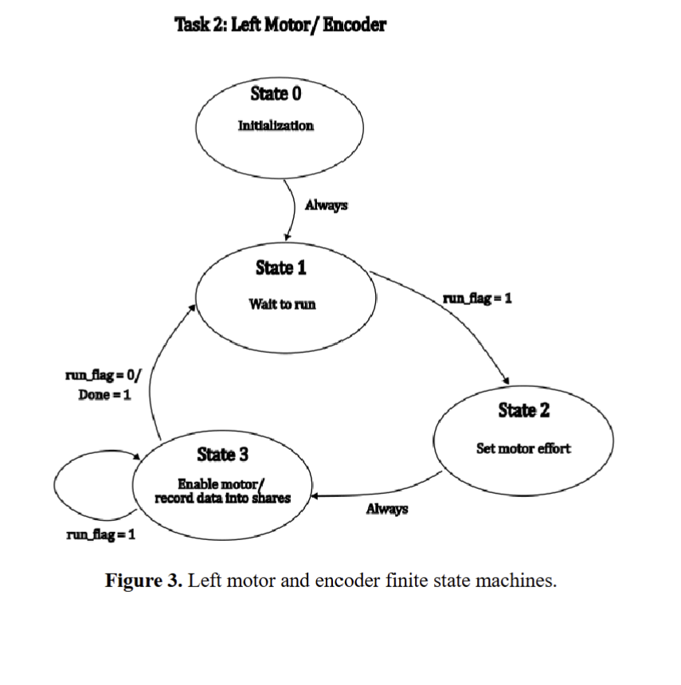
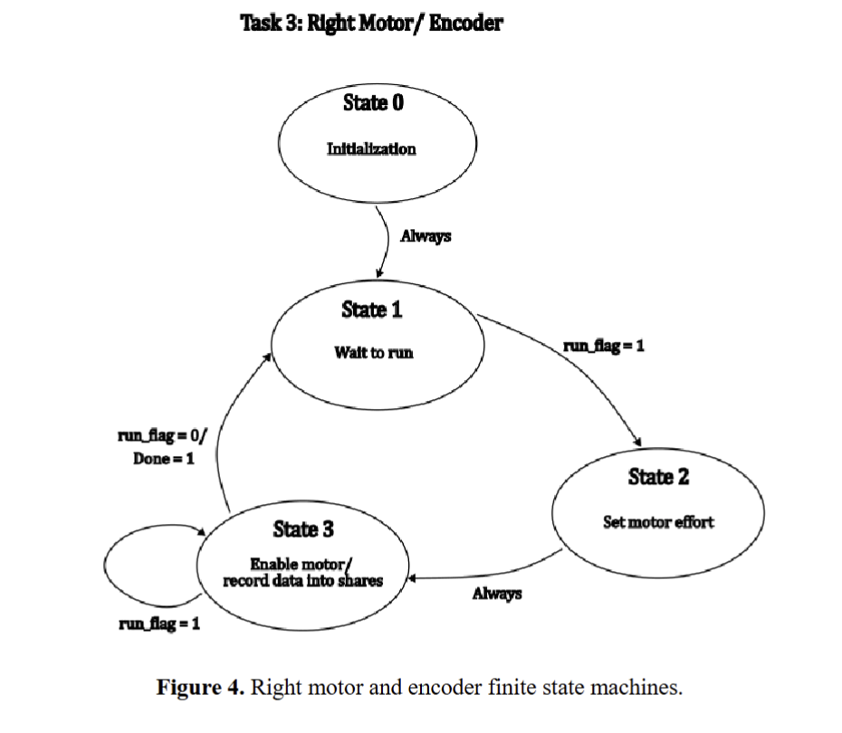
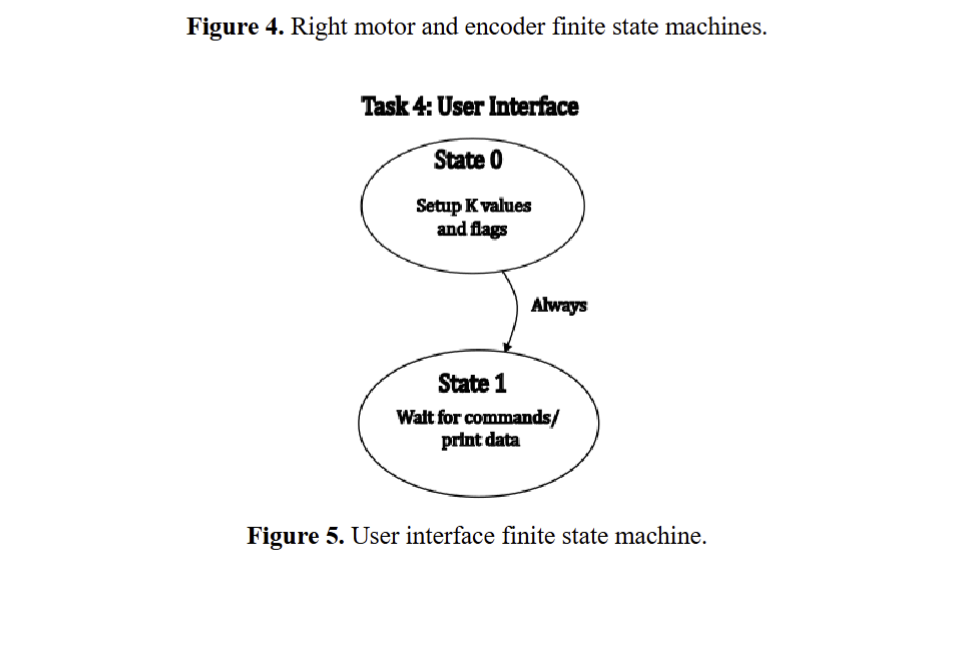
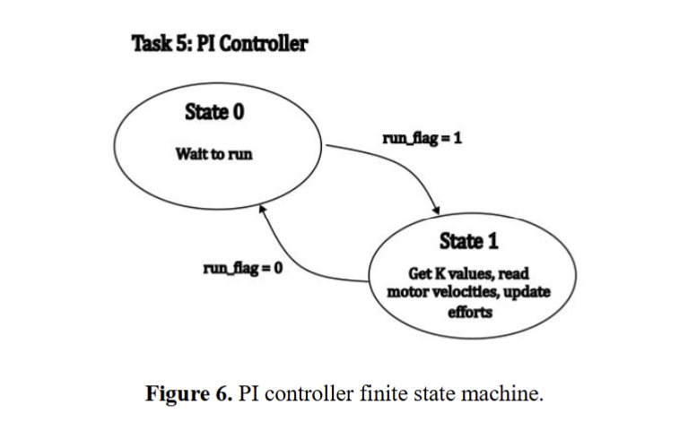
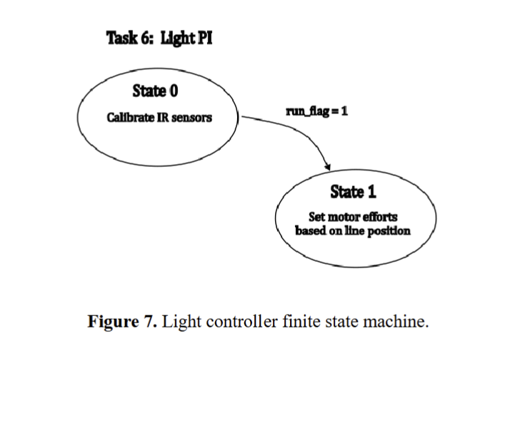
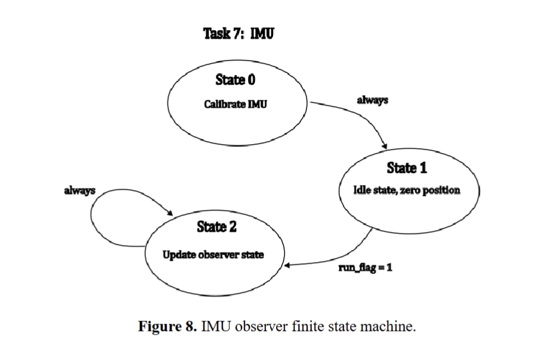

Tasks
=========

1. data_collec_gen
------------------
Continuously samples important shared variables from the rest of the system (wheel velocities, motor efforts, estimated states like Xhat, line centroid, path state, etc.) and packages them into a compact stream. This stream is then sent over USB or Bluetooth so you can capture it on a laptop for plotting and analysis. The task is mainly for debugging and tuning: it lets you see how Romi’s internal signals evolve over time when running the course. It usually runs at a lower rate than the control loops so it doesn’t overload the CPU or the serial link.

Finite state machine
~~~~~~~~~~~~~~~~~~~~~~~~~~~~~~~~~~~~~~~~~~~~~~~~~

2. left_ME_gen
----------------------
Implements the left motor’s “motor effort” or speed control loop. It reads the desired left-wheel speed (or effort) from a shared variable, compares it against the measured wheel speed from the encoder/state estimator, and runs a PI controller to compute the appropriate PWM/effort command. The task also handles clamping and any safety limits, making sure the motor command stays within reasonable bounds. Its job is to make the left wheel accurately track whatever forward/steering command the higher-level tasks decide.

Finite state machine
~~~~~~~~~~~~~~~~~~~~~~~~~~~~~~~~~~~~~~~~~~~~~~~~~

3. right_ME_gen
-------------------------
Same idea as left_ME_gen, but dedicated to the right wheel. It takes the right-wheel setpoint from shared variables and uses the measured speed to drive a PI loop that outputs the right motor’s effort. By keeping the right wheel tightly controlled, this task helps Romi move straight when both setpoints are equal and rotate cleanly when steering commands create a speed difference. Together, left_ME_gen and right_ME_gen turn high-level “go this fast / turn this much” commands into actual, stable wheel motion.

Finite state machine
~~~~~~~~~~~~~~~~~~~~~~~~~~~~~~~~~~~~~~~~~~~~~~~~~

4. UI_gen
--------------------------
Manages the simple text-based user interface over the USB/serial REPL. It parses commands you type (like xdis, ydis, position, sensor checks, calibration routines, and enable/disable switches) and prints back formatted status lines. This task is what lets you inspect shared variables live on the robot without changing code, and also gives you a way to trigger actions (like starting a run, recalibrating light sensors, or printing estimator values). It’s your main “window” into Romi while you’re testing on the bench.

Finite state machine
~~~~~~~~~~~~~~~~~~~~~~~~~~~~~~~~~~~~~~~~~~~~~~~~~

5. PI_con
------------------------------
The PI task runs the proportional–integral (PI) control loop that turns errors into stable motor commands.It repeatedly compares a setpoint (what you want – speed, heading, or line position) to a measurement (what Romi is actually doing) to compute an error. The task then applies a proportional term (reacts to the current error) and an integral term (reacts to the accumulated past error) to generate a control output. That output is sent to the motor effort shares (or steering command), keeping Romi on target while reducing steady-state error and smoothing out its motion.

Finite state machine
~~~~~~~~~~~~~~~~~~~~~~~~~~~~~~~~~~~~~~~~~~~~~~~~~

6. Light
---------------------------------
Reads the raw light sensor values from the sensor array, applies black/white calibration, and computes a normalized line position (centroid) across the sensors. That centroid is then fed into a steering PI controller, which generates a steering correction signal that gets mixed into left and right wheel setpoints. The task can also enable/disable line-following behavior based on PATH_STATE or other flags, so you can temporarily ignore the line in certain parts of the track. Overall, light_gen is what makes Romi “lock onto” the black line and follow it smoothly through curves.

Finite state machine
~~~~~~~~~~~~~~~~~~~~~~~~~~~~~~~~~~~~~~~~~~~~~~~~~

7. IMU
------------------------------------------
Handles communication with the IMU over I²C, including initialization, configuration, and regular sensor reads. It pulls gyro and accelerometer measurements, possibly applies calibration offsets or simple filtering, and writes cleaned values into shared variables. The state estimator can then use those IMU signals (for yaw rate, for example) to improve heading estimation. In turn, that more accurate heading can drive behaviors like precise 90° turns or detecting when Romi has rotated enough to move to the next track state. It also handles the mathamatical computations for the state estimation machines and stores them in the appropriate shared value.

Finite state machine
~~~~~~~~~~~~~~~~~~~~~~~~~~~~~~~~~~~~~~~~~~~~~~~~~

8. Track
-----------------------------------------
Implements the high-level state machine that decides what Romi should be doing right now along the course. It uses signals like Xpos, Ypos, net distance, heading, and sometimes light information to detect key regions: normal line following, splits, tight-turn zones, straight-ahead gaps with no line, wall-approach, turning around obstacles, etc. For each state or “phase,” it sets shared variables like PATH_STATE, bias terms, or special flags that tell other tasks (especially light_gen and the motor control) how to behave. This task is essentially Romi’s “strategy brain” for the specific track layout.

Finite state machine
~~~~~~~~~~~~~~~~~~~~~~~~~~~~~~~~~~~~~~~~~~~~~~~~~

