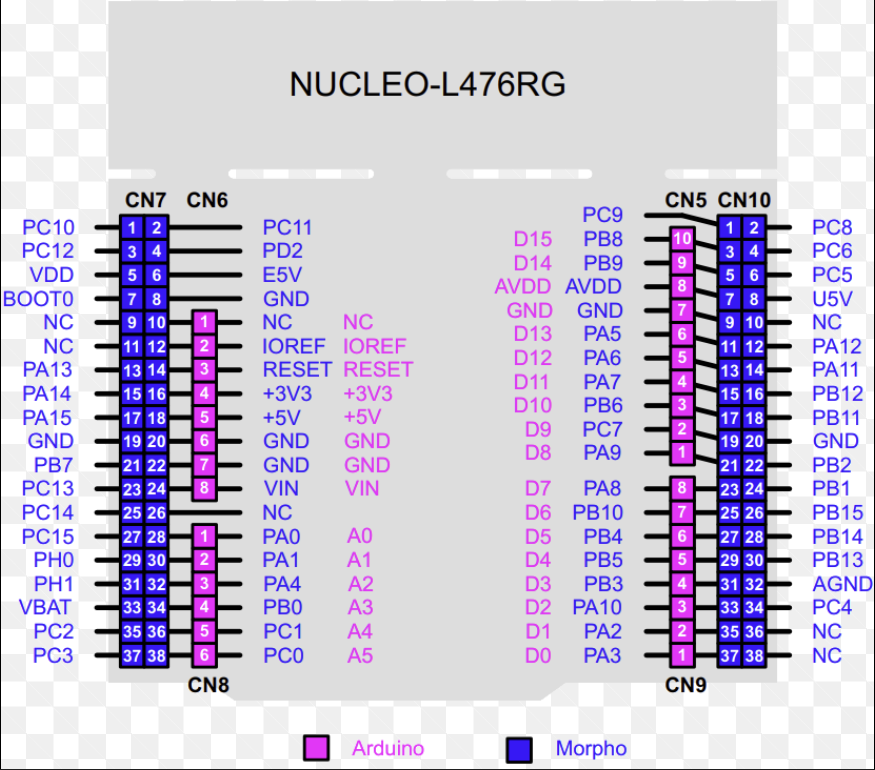

Wiring diagram
=======================

Nucleo micro-controller pinout
--------------------------------

For the pin designations we used where the ones for the morph board.(dark blue labels)

Wiring table
-------------------------------

.. figure:: ../../images/Romi_pinout.png
    :align: center
    :height: 500px
    :alt: alternate text

This figure illustates the pins that we used on the nucleo board aswell as what those pins where connected to. We also identified which timers the encoder and motors used for better organization.
